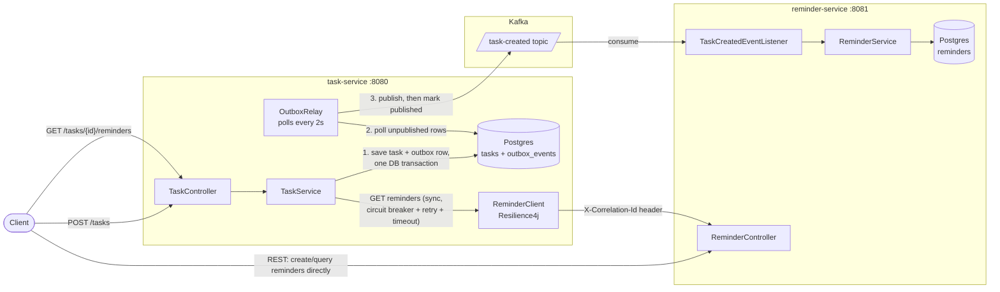

# task-service

Owns tasks: creating them, listing them, exporting them, and giving
clients a way to look up the reminders associated with a task. It is one
half of a two-service system — the other half, reminder-service, owns
reminders — split along a clear domain boundary and communicating over
both Kafka (asynchronous) and REST (synchronous), deliberately, for two
different kinds of interaction.

Together, task-service and reminder-service demonstrate:

- **Microservice boundaries** — tasks and reminders are owned, deployed,
  and scaled independently, each with its own database and API.
- **Resilient inter-service communication** — the synchronous call from
  task-service to reminder-service is protected by a circuit breaker,
  retry with exponential backoff, a timeout, and a graceful fallback.
- **Event-driven design, made durable** — task creation writes an outbox
  row in the same database transaction as the task itself, and a separate
  relay process publishes it to Kafka. Task creation never depends on
  Kafka being reachable, and the event can never be silently lost to a
  mid-request crash.

## Architecture



**Write path (create a task) — asynchronous, via a transactional outbox.**
`POST /tasks` writes the task row and a `TaskCreated` outbox row in a
single database transaction, then returns immediately; it never calls
Kafka on the request thread. A separate `OutboxRelay` polls for
unpublished outbox rows on a fixed interval and publishes each to Kafka,
marking it published only once the send succeeds. Because the task and
its event are written atomically, a crash between the two is not
possible — either both are durable or neither is, and task creation's
success or failure never depends on Kafka being reachable.

**Read path (look up reminders for a task) — synchronous.**
`GET /tasks/{taskId}/reminders` calls reminder-service's REST API
directly: this is a live read on behalf of a waiting client, and there is
no natural way to make "fetch me the current reminders" asynchronous.
Because this call can fail or hang, it is wrapped in Resilience4j
(circuit breaker, retry, timeout) with a fallback to an empty list.

## Persistence

Postgres via Spring Data JPA, with Flyway owning the schema
(`src/main/resources/db/migration`); `spring.jpa.hibernate.ddl-auto` is
set to `validate`, so Hibernate only checks the schema matches the
entities at startup rather than generating DDL itself. Two tables:

- `tasks` — one row per task.
- `outbox_events` — the transactional outbox described above. A row's
  `published_at` is set once the relay successfully sends it; unpublished
  rows are retried on the relay's next poll.

The `Task` domain type is a plain record; a `TaskEntity` (JPA) plus a thin
`TaskRepository` adapter handle the mapping to and from it, so the rest
of the codebase has no direct dependency on JPA.

## Outbox relay

`OutboxRelay` is a scheduled poller (`outbox.relay.poll-interval-ms`,
default 2000ms) that reads unpublished outbox rows, publishes each to
Kafka via `KafkaEventPublisher`, and marks it published on success. A row
that fails to send — Kafka unreachable, a timeout — is simply left
unpublished and retried on the next poll.

This is a polling publisher rather than CDC (change data capture, e.g.
Debezium tailing Postgres's write-ahead log). A poller is simpler to run
and operate: no extra infrastructure, just a scheduled query against one
table. CDC removes poll-interval latency and the periodic query entirely,
at the cost of a separate system to deploy, configure, and monitor.

Correlation ids are captured into the outbox row at write time
(`OutboxEventFactory`, running on the original request thread), not read
from request context when the relay publishes — by then the relay is
running on a scheduler thread with no request context available.

## Resilience

`ReminderClient.getRemindersForTask`, the synchronous read path above, is
protected by:

- **Timeout** — the shared `RestTemplate` has separate connect/read
  timeouts (`reminder.service.connect-timeout-ms` / `read-timeout-ms`,
  default 1s/2s).
- **Retry** — up to 3 attempts with exponential backoff (200ms, 400ms,
  ...) on connection failures and 5xx responses.
- **Circuit breaker** — opens after enough failures in a sliding window
  of 10 calls (50% failure rate, or too many slow calls), so a
  persistently down reminder-service stops being hammered with retries.
- **Fallback** — on any failure, including "circuit open," the call
  returns an empty list and logs a warning rather than propagating the
  error to the client.

Tuning lives in `application.yaml` under `resilience4j.*` and
`reminder.service.*`.

## Correlation IDs & logging

A servlet filter reads (or generates) `X-Correlation-Id` on every
incoming request, puts it in the logging MDC, and echoes it on the
response. That id propagates to reminder-service on both paths: as an
HTTP header on the outbound REST call, and as a Kafka record header on
the event the outbox relay publishes. Logs are structured JSON
(`logstash-logback-encoder`) with `correlationId` as a field, so a
request can be traced across both services' logs.

## Endpoints

| Method | Path                         | Description                                                              |
|--------|------------------------------|---------------------------------------------------------------------------|
| GET    | `/tasks`                     | List all tasks                                                           |
| POST   | `/tasks`                     | Create a task; writes a `TaskCreated` outbox row in the same transaction |
| GET    | `/tasks/{taskId}/reminders`  | Fetch reminders for a task (resilient REST call)                        |
| GET    | `/exports/xlsx`              | Export all tasks to an Excel file                                       |
| GET    | `/health`, `/metrics`, `/prometheus` | Actuator (custom base path: root, not `/actuator`)               |
| GET    | `/swagger-ui.html`           | Interactive API docs                                                     |

## Running locally

### With docker-compose (task-service + reminder-service + Kafka + Postgres)

Assumes reminder-service is checked out as a sibling directory (i.e.
`task-service/` and `reminder-service/` share the same parent folder) —
the compose file builds reminder-service from `../reminder-service`.

```bash
docker-compose up --build
```

Brings up Kafka, a dedicated Postgres per service (`task-db`,
`reminder-db`, each with its own volume), and both applications.

- task-service: http://localhost:8080
- reminder-service: http://localhost:8081
- Kafka: localhost:9092
- task-db: localhost:5433, reminder-db: localhost:5434 (exposed for local
  inspection with a DB client; the applications reach them over the
  compose network)

### Standalone

task-service requires a reachable Postgres to start, since Flyway runs
its migrations against `spring.datasource.url` at startup. Point it at
any Postgres via environment variables:

```bash
DB_HOST=localhost DB_PORT=5433 DB_NAME=tasks DB_USERNAME=task DB_PASSWORD=task \
  mvn spring-boot:run
```

Neither reminder-service nor Kafka needs to be running for task-service
to start and serve requests: reminder-service calls fail resiliently
(empty list, logged warning), and outbox rows are simply left unpublished
until Kafka and the relay catch up.

## Tests

`mvn verify` runs both unit tests (`*Test`, via `maven-surefire-plugin`)
and integration tests (`*IT`, via `maven-failsafe-plugin`). The `*IT`
tests use [Testcontainers](https://testcontainers.com) to run against a
real Postgres and require Docker; `mvn test` alone needs no Docker and
covers everything else.

- **Unit tests** — service/controller logic, DTO mapping, correlation-id
  filter/interceptor behavior, `OutboxEventFactory`'s event construction
  and correlation-id capture, and `KafkaEventPublisher`'s header
  handling — all in isolation, with no Spring context.
- **`ReminderClientResilienceTest`** — exercises the actual timeout,
  retry, and fallback behavior against a real dead port and a
  deliberately slow `HttpServer`, not mocks.
- **`TaskRepositoryIT`** — a real Postgres (Testcontainers) with the
  Flyway-migrated schema applied, proving the entity mapping and the
  actual SQL agree.
- **`OutboxRelayIT`** — drives the real `TaskService` end to end (a real
  Postgres transaction) and asserts the real `OutboxRelay` picks up the
  resulting row, publishes it to an embedded Kafka topic, and marks it
  published.
- **`ApplicationIT`** — full Spring context against a real Postgres, plus
  a health check.
