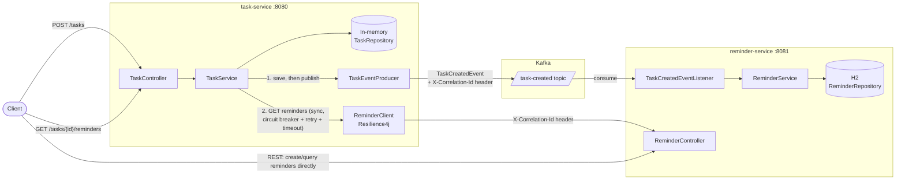

# task-service

Owns tasks: creating them, listing them, exporting them, and letting a
client look up the reminders associated with a task. It is one half of a
two-service system — the other half, [reminder-service](../reminder-service),
owns reminders — and the two talk to each other over both Kafka (async) and
REST (sync), on purpose, for two different kinds of interaction.

This project (together with reminder-service) is a portfolio piece
demonstrating:

- **Microservice boundaries** — tasks and reminders are owned, deployed, and
  scaled independently, each with its own data store and API.
- **Resilient inter-service communication** — the synchronous call from
  task-service to reminder-service is protected by a circuit breaker, retry
  with exponential backoff, a timeout, and a graceful fallback.
- **Event-driven design** — task creation doesn't block on reminder-service
  at all; it publishes an event and moves on.

## Architecture



**Write path (create a task) — asynchronous:** `POST /tasks` saves the task,
then publishes a `TaskCreated` event to Kafka and returns immediately.
reminder-service consumes that event on its own schedule and creates the
reminder. task-service never blocks on reminder-service to accept a new
task, and reminder-service being down or slow has zero effect on task
creation.

**Read path (look up reminders for a task) — synchronous:**
`GET /tasks/{taskId}/reminders` calls reminder-service's REST API directly,
because this is a live read on behalf of a waiting client — there's no
sensible way to make "fetch me the current reminders" asynchronous. Since
this call **can** fail or hang, it's wrapped in Resilience4j (circuit
breaker + retry + timeout) with a fallback to an empty list.

## Resilience

`ReminderClient.getRemindersForTask` (called from the read path above) is
protected by:

- **Timeout** — the shared `RestTemplate` has separate connect/read timeouts
  (`reminder.service.connect-timeout-ms` / `read-timeout-ms`, default 1s/2s).
- **Retry** — up to 3 attempts with exponential backoff (200ms, 400ms, ...)
  on connection failures and 5xx responses.
- **Circuit breaker** — opens after enough failures in a sliding window of
  10 calls (50% failure rate, or too many slow calls), so a persistently
  down reminder-service stops being hammered with retries.
- **Fallback** — on any failure (including "circuit open"), the call
  returns an empty list and logs a warning instead of propagating the
  error to the client.

Tuning lives in `application.yaml` under `resilience4j.*` and
`reminder.service.*`.

The `TaskEventProducer`'s Kafka publish is best-effort in the other
direction: if Kafka is unreachable, task creation still succeeds (the
producer's `max.block.ms` is capped at 3s and the publish call is wrapped
in a try/catch) — a degraded Kafka never blocks or fails a task creation
request.

## Correlation IDs & logging

A servlet filter reads (or generates) `X-Correlation-Id` on every incoming
request, puts it in the logging MDC, and echoes it on the response. That id
is then propagated to reminder-service on **both** paths: as an HTTP header
on the outbound REST call, and as a Kafka record header on the published
event. Logs are structured JSON (`logstash-logback-encoder`) with
`correlationId` as a field, so a request can be traced across both
services' logs.

## Endpoints

| Method | Path                      | Description                                              |
|--------|---------------------------|------------------------------------------------------------|
| GET    | `/tasks`                  | List all tasks                                            |
| POST   | `/tasks`                  | Create a task; publishes a `TaskCreated` Kafka event       |
| GET    | `/tasks/{taskId}/reminders` | Fetch reminders for a task (resilient REST call)         |
| GET    | `/exports/xlsx`           | Export all tasks to an Excel file                          |
| GET    | `/health`, `/metrics`, `/prometheus` | Actuator (custom base path: root, not `/actuator`) |
| GET    | `/swagger-ui.html`        | Interactive API docs                                       |

## Running locally

### With docker-compose (task-service + reminder-service + Kafka)

Requires reminder-service checked out as a **sibling directory** (i.e.
`task-service/` and `reminder-service/` share the same parent folder) —
the compose file builds reminder-service from `../reminder-service`.

```bash
docker-compose up --build
```

- task-service: http://localhost:8080
- reminder-service: http://localhost:8081
- Kafka: localhost:9092

### Standalone

```bash
mvn spring-boot:run
```

Reminder-service calls will fail resiliently (empty list / logged warning)
if reminder-service isn't also running, and Kafka publish failures are
logged and swallowed if Kafka isn't running. Nothing about starting
task-service alone requires the rest of the system to be up.

## Tests

`mvn verify` runs both unit tests (`*Test`) and integration tests
(`*IT`, via `maven-failsafe-plugin`):

- **Unit tests** — service/controller logic, DTO mapping, correlation-id
  filter and RestTemplate interceptor behavior in isolation.
- **`ReminderClientResilienceTest`** — spins up a real dead port and a
  deliberately slow `HttpServer` to exercise the actual timeout/retry/
  fallback behavior against real sockets, not mocks.
- **`TaskEventProducerTest`** — publishes to an embedded Kafka broker
  (`@EmbeddedKafka`) and asserts the event lands on the topic with the
  right payload.
- **`ApplicationIT`** — full Spring context + health check.

## Known limitations / future improvements

- task-service's own persistence is an in-memory `HashMap` (unchanged from
  before this work) — restarting the service loses all tasks. Swapping in
  a real database is a reasonable next step but out of scope here.
- No outbox pattern: if the app crashes between saving a task and
  publishing its event, that task's event is lost. An outbox table plus a
  relay would close that gap.
- No Flyway/Liquibase (reminder-service uses `ddl-auto`-equivalent JPA
  bootstrapping); fine for a demo, not for production schema changes.
